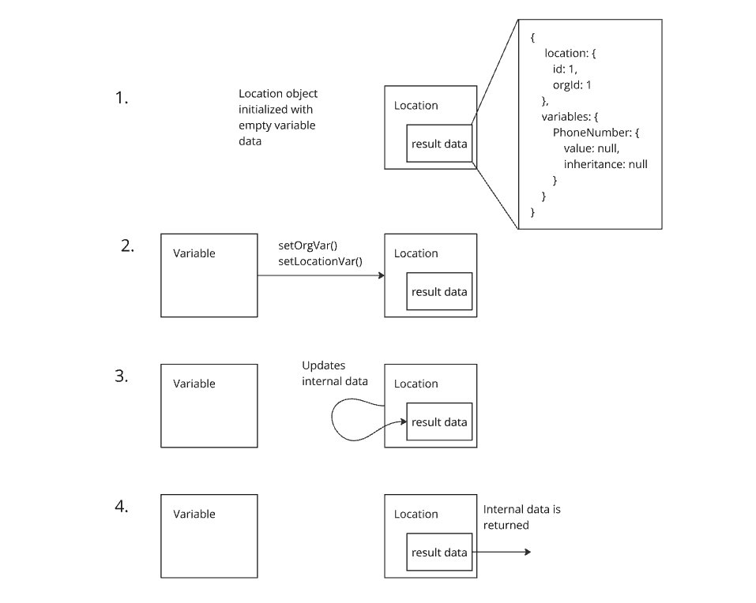
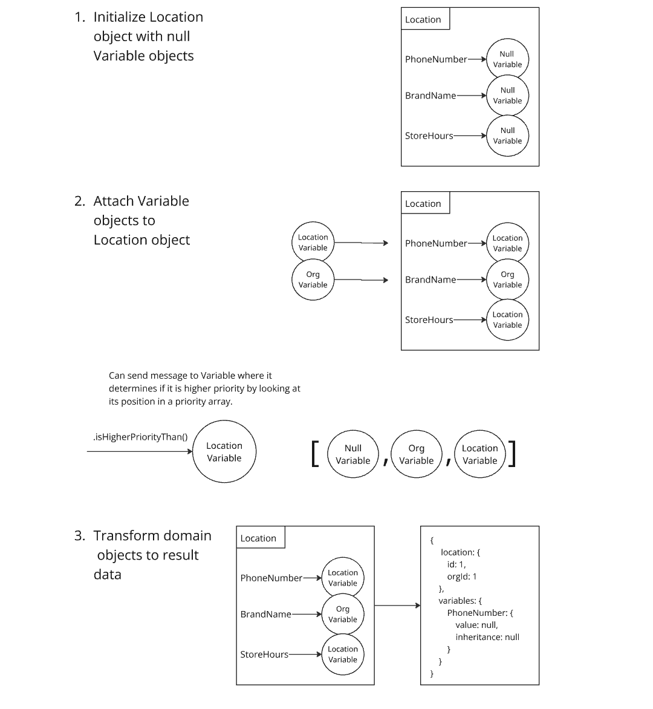

# Swivl Challenge

### Dependencies
- Docker

### Setup
```sh
# make sure docker is running
git clone https://github.com/msolorio/swivl_challenge.git
cd swivl_challenge
make build
make dev
```

### Test API
Once the server is running on port 3000 you can start sending requests to it.
```sh
curl http://localhost:3000/api/locations/4?variables=PhoneNumber,BrandName
```

Run tests
```sh
make test
```
_____

## Design documents

### High level design

____

### Domain logic - current implementation


____

### Domain logic - with rich domain model

